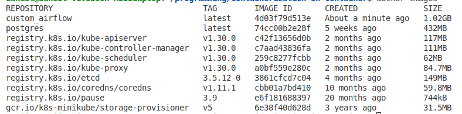

# Containerization-in-container

1) Запускаем minikube

```bash
minikube start
```

2) Маунтим dags к minikube (можно и все остальные, но я тестировал только с dags)

```bash
minikube mount ./dags:/mnt/dags
```

3) Запускаем postgres 

```bash
kubectl create -f postgres.yml
```

4) Билдим custom docker-image внутри minikube

4.1. Переходим "внутрь" minikube

```bash
eval $(minikube docker-env)
```

4.2. Билдим image

```bash
docker build -t custom_airflow .
```

4.3. Проверяем, что image появился 

```bash
docker images
```



4.4. Выходим из minikube

```bash
eval $(minikube docker-env --unset)
```

5) Запускаем airflow 

```bash
kubectl create -f airflow.yml
```

6) подключаемся извне и радуемся результату

```bash
minikube service airflow
```