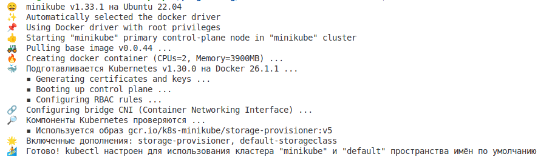

# Containerization-in-container


### 1. Установка kubectl и minikube. Запуск всего этого добра

Устанавливаем kubectl с сайта k8s (У меня убунту)


Устанавливаем minikube


Запускаем minikube 


И смотрим на него


Все здорово!

### 2. Запускаем postgres и minikube

Выполняем последовательно:

```bash
kubectl create -f pg_configmap.yml
kubectl create -f pg_secret.yml 
kubectl create -f pg_service.yml 
kubectl create -f pg_deployment.yml

kubectl create nextcloud.yml
kubectl expose deployment nextcloud --type=NodePort --port=80
minikube service nextcloud
```

Восхищаемся собственным облаком


**Вопрос 1: Важен ли порядок выполнения этих манифестов? Почему?**

Да, порядок выполнения этих манифестов для Kubernetes имеет значение, так как deployment манифест, зависит от configmap манифеста. 

Оптимальный порядок выполнения:

- **pg_configmap.yml**: ConfigMap должен быть создан первым, так как он содержит конфигурационные данные, которые будут использоваться в деплойменте.
- **pg_service.yml**: Service должен быть создан вторым, чтобы обеспечить доступ к поду с PostgreSQL, который будет создан деплойментом.
- **pg_deployment.yml**: Deployment должен быть создан последним, так как он использует ConfigMap для конфигурации контейнера


**Вопрос 2: Что (и почему) произойдет, если отскейлить количество реплик postgres-deployment в 0, затем обратно в 1, после чего попробовать снова зайти на Nextcloud?**

Nextcloud перестанет запускаться (см картинку ниже), потому что он предварительно сохранил в БД нужные ему данные, а из-за перезапуска БД (и отсутствие volume), данные потерялись. Это можно исправить добавлением постоянного volume


